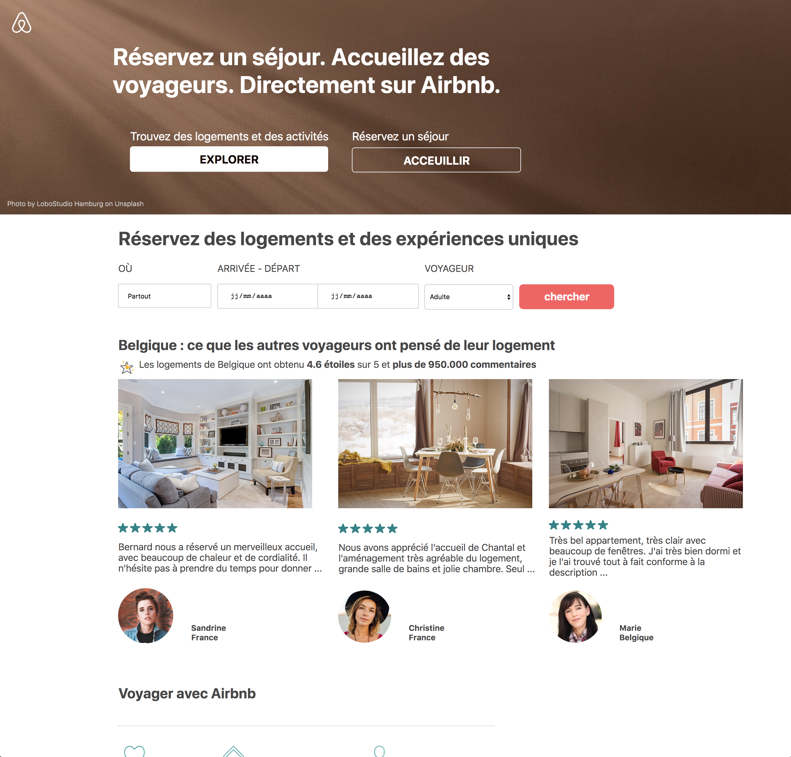

# airBnB

Reproduire en HTML/CSS + media queries le design du site de rbnb en essayant que ça soit le plus ressemblant possible. (difficulté ++)

**A quoi ça ressemble ?** 

https://kodok-hugues.github.io/AirBnB/.

## Remarques:
Remise et fin du travail par abandon :o)
Impossible de trouver/comprendre pourquoi j'ai un "scroll" horizontal.

